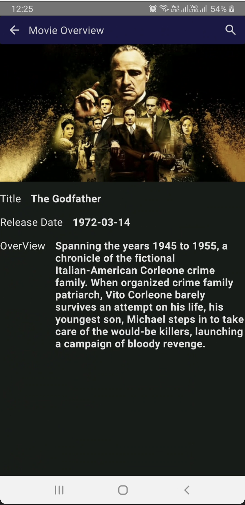
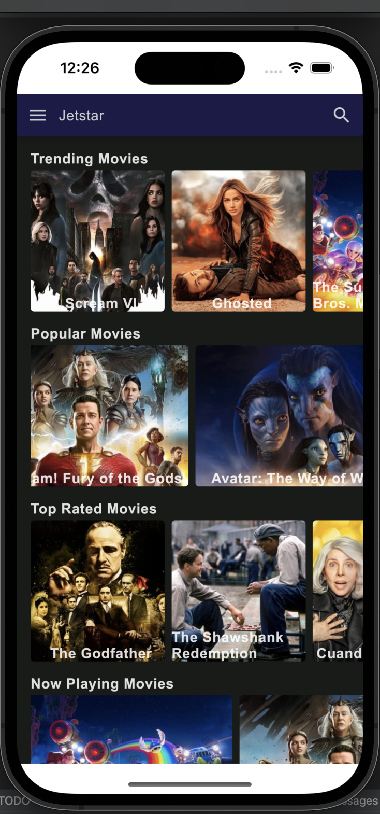
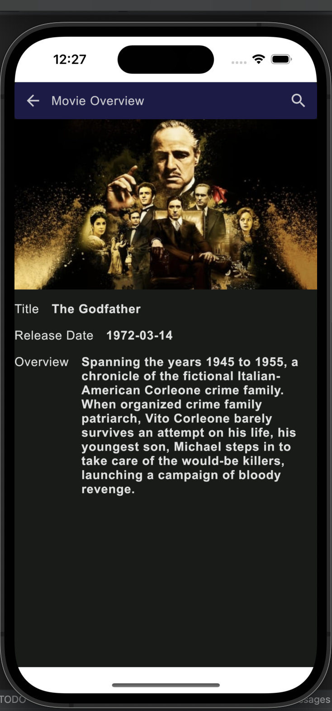

# :star: Jetstar KMM

 Jetstar is sample app demonstrating the use of Jetbrain's 
<a href="https://kotlinlang.org/docs/multiplatform-mobile-getting-started.html">Kotlin Multiplatform for Mobile</a> for mobile app development

|  What's shared?   | ViewModel, Data Models, Networking and UI (almost 100%) code is shared |
|----------------	|------------------------------	|
|  :arrow_up_down: API   | [TMDB](https://www.themoviedb.org/documentation/api) |
|     UI Framework  | [Jetpack Compose](https://www.jetbrains.com/lp/compose-multiplatform/)         |                        |
| 💉 DI                | [Koin](https://insert-koin.io/)                        |             |
| 🌐 Networking        | [Ktor](https://ktor.io/)                        |
| :compass: Navigation       | [Decompose](https://arkivanov.github.io/Decompose/) + [Router](https://github.com/xxfast/KRouter)

## :iphone: Screenshots
#### Android App
<table style="width:100%">
  <tr>
    <th>Home Screen</th>
    <th>Overview Screen</th> 
  </tr>
  <tr>
    <td></td> 
    <td></td>
  </tr>
</table>

#### iOS App
<table style="width:100%">
  <tr>
    <th>Home Screen</th>
    <th>Overview Screen</th> 
  </tr>
  <tr>
    <td></td> 
    <td></td>
  </tr>
</table>

## Screen Recording

https://user-images.githubusercontent.com/49483235/234791448-6e790ba8-7906-49e8-a12e-157d0e7a813a.mp4

## How to run the app
Download Android Studio Electric Eel | 2022.1.1 or above.

Generate API key from [The Movie Database API](https://developers.themoviedb.org/3), place the key in 'local.properties' file as API_KEY="<YOUR_API_KEY_HERE">.

[<a href="#top">Back to top</a>]

